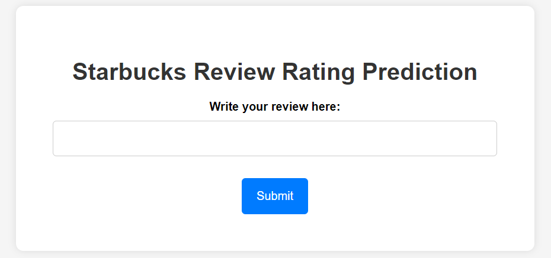
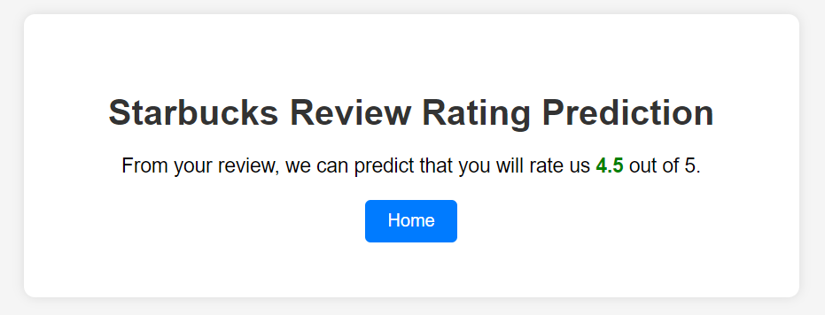

# Starbucks Reviews NLP Project

This GitHub repository contains the code and resources for a Natural Language Processing (NLP) project focused on analyzing and predicting Starbucks reviews. The project includes data preprocessing, text analysis, model training, and a simple Flask web application for predicting review ratings.

## Table of Contents
- [Dataset](#dataset)
- [Data Preprocessing](#data-preprocessing)
- [Text Preprocessing](#text-preprocessing)
- [Balancing the Dataset](#balancing-the-dataset)
- [Model Training](#model-training)
- [Flask Web Application](#flask-web-application)
- [Running the Flask Web App](#running-the-flask-web-app)

## Dataset

The dataset, named `reviews_data.csv`, includes the following columns:
- `name`: Name of the reviewer
- `location`: Location of the reviewer
- `date`: Date of the review
- `rating`: The rating given by the reviewer (1 to 5)
- `review`: The text of the review
- `image_links`: Links to images associated with the review

## Data Preprocessing

1. Import necessary libraries including numpy, pandas, matplotlib, seaborn, nltk.
2. Load the dataset from the CSV file.
3. Check the shape of the dataset.
4. Drop all columns except `rating` and `review`.
5. Remove duplicate rows.
6. Drop rows with missing values.
7. Convert the `rating` column to integer data type.

## Text Preprocessing

1. Clean the text in the `review` column by selecting only alphabetic characters and converting them to lowercase.
2. Tokenize the reviews by splitting them into words.
3. Remove stop words using NLTK.
4. Perform lemmatization on the remaining words.
5. Join the words back into a single string and save it in the `review` column.

## Balancing the Dataset

To balance the dataset, down-sample the reviews for ratings 1, 2, 3, and 4 to match the number of reviews for rating 5. The resulting balanced dataset is saved as `balanced_df`.

## Model Training

1. Convert text data into numerical vectors using various techniques:
   - Bag of Words (Count Vectorizer)
   - TF-IDF Vectorizer
   - Continuous Bag of Words (CBOW)
   - Skip-gram
   - Pretrained Word Embeddings "word2vec-google-news-300"
   
2. Train a classification model using logistic regression on the vectorized data.
3. Evaluate the model's performance, achieving an accuracy score of 0.58 for multiclass classification.
4. Save the model using the `pickle` library.
5. Convert the problem into binary classification by creating a new column, `B_Rating`, where 1 and 2 are mapped to "Bad" and 3, 4, 5 are mapped to "Good."

## Balancing the Binary Dataset

To balance the binary dataset, down-sample "Bad" and "Good" reviews to match each other. The resulting balanced dataset is saved as `balanced_df1`.

## Model Training (Binary Classification)

1. Reapply the text vectorization techniques.
2. Split the data into training and testing sets.
3. Normalize the feature data using Min-Max scaling.
4. Train a logistic regression model for binary classification.
5. Achieve an accuracy score of 0.84 for the binary classification problem.
6. Generate a confusion matrix, heatmap, and classification report.

## Flask Web Application

The Flask web application (`app.py`) is created to deploy the trained predictive model. It allows users to input their review and receive predictions what rating they likely to give. The web application consists of two main HTML templates:
- `index.html`: The homepage where users input review.
- `prediction.html`: The page displaying the prediction.

## Running the Flask Web App

To run the Flask web app, follow these steps:
1. Install the required libraries listed in `requirements.txt` using `pip install -r requirements.txt`.
2. Run the Flask app by executing `python app.py`.
3. Open the web app in your browser by navigating to `http://localhost:5000`.

For any questions or suggestions, please feel free to contact me on LinkedIn.

## Webpage Glimpse:

